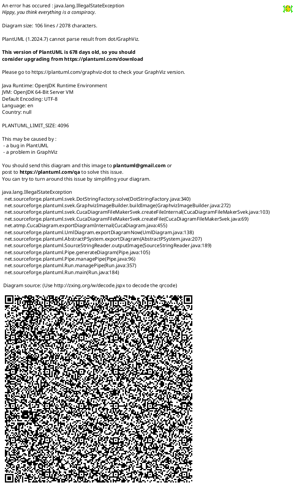

# Detailed Design Document

| **Author**              | Arwa Hesham - Mohammed Hussein - Abdulmalik Ajaj     |
| ------------------------| -----------------------------------------------------|
| **Status**              | `Draft/Inspection/Approved`                          |
| **Version**             | `1.0`                                                |
| **Date**                | `14/11/2025`                                         |

## Introduction

This document presents the design and implementation of an embedded Human–Machine Interface (HMI) system developed using a microcontroller-based architecture and native C programming. The project focuses on acquiring an environmental parameter—such as temperature or light intensity—through an analog-to-digital conversion process and displaying real-time measurements on a 16×2 LCD module. In addition to passive monitoring, the system enables users to configure upper and lower operational limits using three input buttons, allowing dynamic adjustment of acceptable sensor ranges during runtime.

An alert mechanism, implemented using an LED and a buzzer, provides immediate feedback when the sensed value exceeds the predefined thresholds. This approach reflects common practices in industrial and automotive interfaces, where rapid and clear indication of abnormal conditions is essential for safety and system reliability.

### Purpose

The purpose of this project is to develop an embedded Human–Machine Interface (HMI) system capable of sensing, displaying, and managing an environmental parameter in real time. The system measures a chosen variable—such as temperature and light intensity—through an ADC-enabled sensor and presents the readings on a 16×2 LCD display.
A key objective is to allow users to adjust the high and low operating limits using three input buttons, enabling flexible configuration of acceptable ranges during system operation. while a fourth button switches the display between the temperature and LDR readings. An alert mechanism, implemented through an LED or buzzer, is included to notify the user when the sensor value moves outside these predefined thresholds.

### Scope

This project focuses on designing and implementing a multi-sensor Human–Machine Interface (HMI) that performs real-time data acquisition, display, and threshold-based control using native C on a microcontroller. The system integrates two sensors—temperature and LDR—and presents their readings on a 16×2 LCD interface.

The main objectives include:

Acquiring temperature and light-intensity measurements through the ADC module.

Displaying the currently selected sensor value on the LCD using a dedicated sensor-switch button.

Allowing the user to adjust upper and lower limits using three control buttons.

Activating an LED or buzzer when a reading exceeds its configured threshold.

## Architectural Overview

The system is organized into a three-layer architecture that separates the main application logic from the hardware control and low-level drivers.

### Assumptions & Constraints

Assumptions:

- Users understand how to use the 4 buttons (select sensor, select limit, increment, decrement)by pressing one time on one button at a time.
- Users will input sensible upper and lower limit values.

Constrains:

- The microcontroller operates at a stable 16 MHz clock speed.
- Only one analog input can be read at a time, since the ADC is single-channel. This means the system can read either a one sensor value or the LCD shield’s analog button input at any given moment, requiring sequential not simultaneous sampling.
- lcd display only 16*2 characters it allows only display 32 characters on two lines at a time .

## Functional Description

| Function  | Description |
|-----------|--------------------------------------|
| Sensor Data Acquisition | Continuously reads analog input from the temperature sensor or LDR through the ADC module and converts raw ADC values into meaningful physical units using calibrated scaling.|
| LCD Display Management | Updates the 16×2 LCD with the current sensor reading and configured high and low limits, using controlled refresh techniques to minimize flicker and maintain readability.|
| User Input Handling | Processes button inputs for adjusting the high (HL) and low (LL) threshold limits, including debouncing, increment logic, and validation to ensure limits remain within acceptable ranges.|
| Threshold Monitoring | Compares each new sensor reading against the configured HL and LL values to determine whether the parameter is within or outside the acceptable operating range.|
| Alert Mechanism Control |  Activates the LED or buzzer when the sensor reading goes beyond the threshold limits and deactivates the alert when the value returns to the valid range.|

## Implementation of the Module

| Implementation Aspect | Description                                                                                                          |
|-----------------------|----------------------------------------------------------------------------------------------------------------------|
| System Initialization | Configures all hardware peripherals at startup, including the ADC, GPIO pins, and the 16×2 LCD. The ADC is set with the required reference voltage and prescaler, buttons are configured as inputs with pull-ups, and the LED/buzzer pin is initialized as an output.|
| ADC Data Processing   | Initiates ADC conversions, retrieves digital readings, and converts them into physical sensor values (temperature or light intensity) using calibrated scaling formulas. Ensures stable measurements by managing sampling timing and avoiding redundant conversions.|
| LCD Output Handling   | Formats sensor readings and threshold values into display strings and updates the LCD using low-level command and data functions. Refreshing is optimized to occur only when values change, minimizing flicker and improving readability.|
| Button Interaction & Threshold Adjustment |Reads user input from debounced push buttons to increment or decrement the high (HL) or low (LL) limits. Implements validation rules to prevent invalid configurations, such as LL exceeding HL, and ensures limits stay within allowable ranges.|
| Threshold Evaluation Logic |Compares each new sensor value against the configured HL and LL thresholds. Determines whether the value is within the valid operating range or requires triggering an alert condition.|
| Alert Control Mechanism | Activates the LED or buzzer when the sensor reading exceeds the threshold range and deactivates the alert once the value returns to normal. Uses a dedicated GPIO output to ensure fast and reliable alert signaling.|
| Software Modularity & Structure | Organizes the code into separate modules (ADC, LCD, buttons, alert control) to support readability, maintainability, and reuse. Follows embedded software development best practices with clear separation of concerns.|

## Integration and Configuration

### Static Files

| File name      | Contents                                                                                                                    |
|----------------|-----------------------------------------------------------------------------------------------------------------------------|
| HMI.ino        | Main application file that integrates all modules and controls program flow.                                                |
| ADC.ino        |  ADC source file that includes initialization, channel configuration, and analog-to-digital conversion routines.            |
| ADC.h          | ADC header file that defines ADC functions and configuration.                                                               |
| gpio.ino       | GPIO source file for controlling digital input/output pins.                                                                 |
| gpio.h         | GPIO header file that declares GPIO-related functions.                                                                      |
| macros-types.h | header file that contains shared macros, typedefs, and fixed-width data types used across the application.                  |
| Button.ino     | Button source file for reading and processing button states.                                                                |
| Button.h       | Button header file that provides function prototypes for button handling.                                                   |
| lcd.ino        | Source file implementing including command writing, data handling, cursor control, and text formatting for the 16×2 display.|
| lcd.h          | lcd header file that has prototypes, constants, and LCD command definitions.                                                |
| ldr.ino        | ldr Source file describing functions for reading and processing LDR sensor values.                                          |
| ldr.h          | ldr header file that provides function prototypes for ldr reading handling.                                                 |
| lm35.ino       | lm35 Source file that Implements LM35 temperature sensor reading and data conversion logic.                                 |
| lm35.h         | lm35 header file that provides function prototypes for lm35 reading handling.                                               |
| led.ino        | LED source file for controlling LED operations.                                                                             |
| led.h          |LED header file defining LED control functions and constants.                                                                |
| Buzzer.ino     |Buzzer source file for controlling Buzzer operations.                                                                        |
| Buzzer.h       |Buzzer header file defining Buzzer  control functions.                                                                       |

### Include Structure

### Configuration

| Name              | Value range       | Description                                                                          |
|-------------------|-------------------|--------------------------------------------------------------------------------------|
| Debounce Delay    | 50 ms             | Software delay to prevent false button triggers.                                     |
| LED Pin           | Pin 4 (PORTB)     | Digital output pin controlling the LED.                                              |
| Buzzer Pin        | Pin 5 (PORTB)     | Digital input pin connected to the push button.                                      |
| Microcontroller   | ATmega328P        | Target MCU used for implementation.                                                  |
| System Clock      | 16 MHz            | Operating frequency of the MCU.                                                      |
| LM35 Sensor limit | −55°C to +150°C   |Temperature limits for the user-adjustable high and low threshold of the lm35 sensor. |
| LDR Sensor limit  | 0 – 10,000 (Lux)  | light intencity limits for user-adjustable high and low threshold for the LDR sensor.|
| ALERT_TYPE        | LED and Buzzer    | Output device triggered on over/under limit condition                                |
| DISPLAY_MODE      | Temp, LDR         | Which sensor data to show on LCD (controlled by display button)                      |
